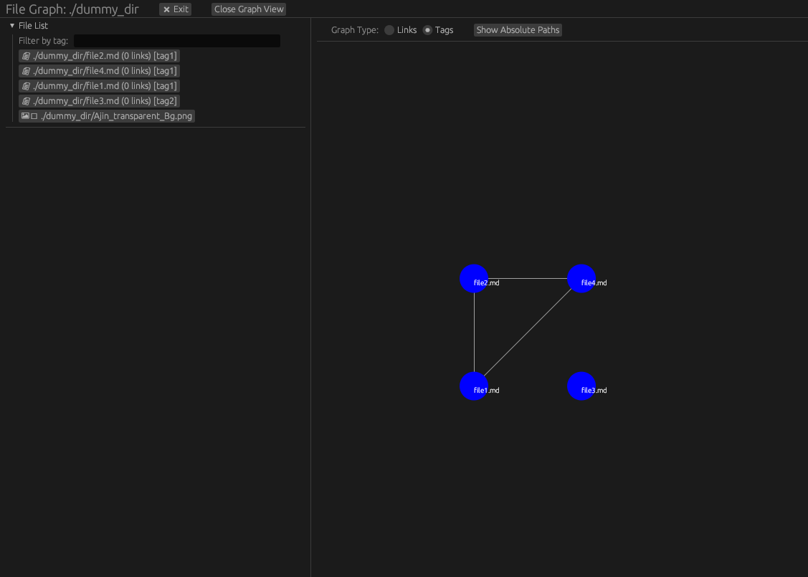
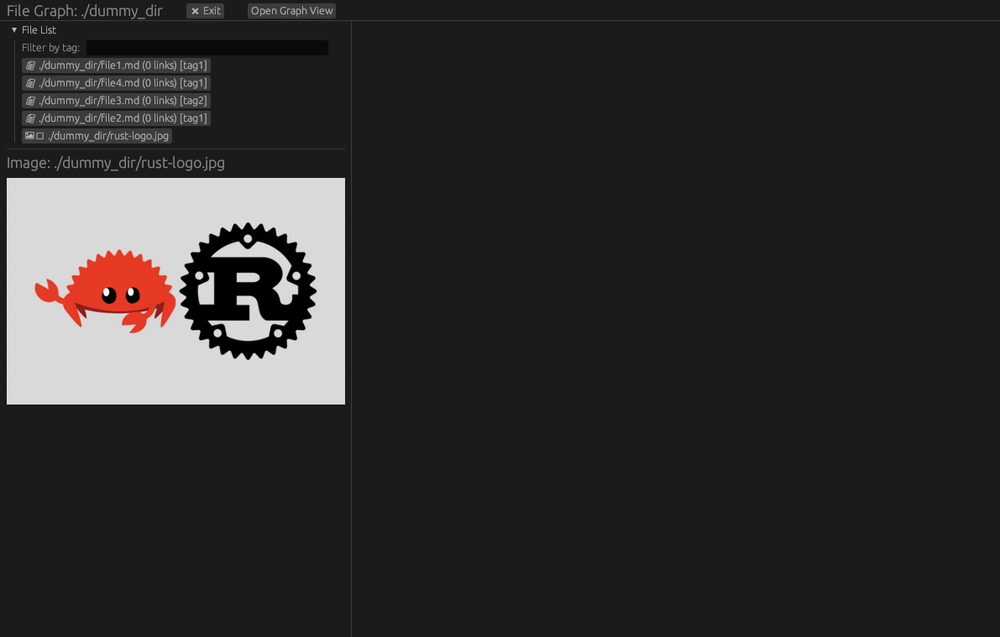

# NexusView

Visualize and explore connections between your files in an interactive knowledge graph. Written in Rust.

## About

NexusView is a desktop application built with Rust and the `egui` framework, designed to help you understand the relationships between your local files. It scans a specified directory, identifies links between files (e.g., Markdown links), and extracts tags, then presents this information as an interactive graph. Whether you're managing a personal knowledge base, research notes, or code documentation, NexusView provides a unique way to navigate and discover connections within your file system.

## Features

- **Interactive Graph Visualization:** Explore your file connections as a dynamic, and pannable graph.
- **Link Graph Mode:** See explicit links between your files (e.g., `[[internal links]]` in Markdown).
- **Tag Graph Mode:** Discover connections based on shared tags found within your files.
- **File List and Filtering:** Easily browse all scanned files and filter them by tags.
- **File Content Preview:** View the content of selected text-based files directly within the application.
- **Image Preview:** Display embedded images.
- **Configurable Path Display:** Toggle between showing full absolute paths or just filenames in the graph.
- **Built with Rust:** High performance and reliability.

## Screenshots


_A screenshot showing the Tag Graph view with interconnected nodes representing files._


_A screenshot showing the Tag Graph view with interconnected nodes representing files._

## Getting Started

### Prerequisites

- Rust programming language (ensure you have `rustup` installed)

### Building and Running

1.  **Clone the repository:**
    ```bash
    git clone https://github.com/Harshit-Dhanwalkar/NexusView.git
    cd NexusView
    ```
2.  **Build the application:**
    ```bash
    cargo build --release
    ```
3.  **Run the application:**

    ```bash
    # Replace `/path/to/your/notes` with the directory you want to scan
    ./target/release/interactive-fm /path/to/your/notes
    ```

    **Example:**

    ```bash
    ./target/release/interactive-fm ~/Documents/MyKnowledgeBase
    ```

## Usage

Upon launching NexusView with a specified directory, the application will scan its contents for files, links, and tags.

- **Left Panel:** Contains a list of all scanned files and images, along with a tag filter input. Clicking on a file here will show its content/image preview and select its corresponding node in the graph (if the graph view is open).
- **Top Panel:** Provides options to exit the application and toggle the graph visualization.
- **Central Panel (Graph View):**
  - **Pan:** Click and drag the background to move the graph.
  - **Nodes:** Represent your files. Click on a node to select it and view its details in the left panel.
  - **Edges:** Represent connections (links or shared tags) between files.
  - **Graph Type Radio Buttons:** Switch between "Links" (explicit file-to-file links) and "Tags" (files connected by shared tags).
  - **Path Display Toggle:** Switch between displaying full absolute paths or just filenames on the graph nodes.

## Todo

- [ ] Fix graph zooming

## Contributing

Contributions are welcome! If you find a bug, have a feature request, or want to contribute code, please feel free to open an issue or submit a pull request.

## License

This project is licensed under the **GNU General Public License v3.0 (GPLv3)**. See the `[LICENSE](LICENSE)` file for more details.

By using, distributing, or modifying this software, you agree to the terms of the GPLv3. This license ensures that all derivative works of NexusView will also be open source under the same license, promoting a vibrant and collaborative open-source ecosystem.
